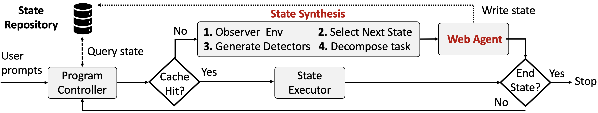
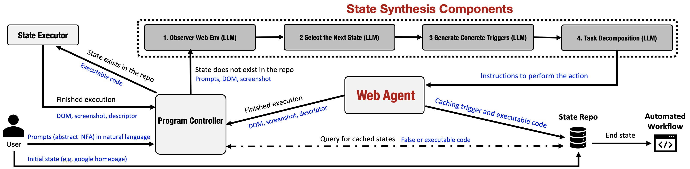

# NetGent

### Reseach Paper:

[NetGent: Agent-Based Automation of Network Application Workflows](https://arxiv.org/abs/2509.00625)

### Agent-Based Automation of Network Application Workflows

NetGent is an AI-agent framework for automating complex application workflows to generate realistic network traffic datasets.

Developing generalizable ML models for networking requires data collection from environments with traffic produced by diverse real-world web applications. Existing browser automation tools that aim for diversity, repeatability, realism, and efficiency are often fragile and costly. NetGent addresses this challenge by allowing users to specify workflows as natural-language rules that define state-dependent actions. These specifications are compiled into nondeterministic finite automata (NFAs), which a state synthesis component translates into reusable, executable code.

Key features:

- Deterministic replay of workflows
- Reduced redundant LLM calls via state caching
- Fast adaptation to changing application interfaces
- Automation of 50+ workflows, including:
  - Video-on-demand streaming
  - Live video streaming
  - Video conferencing
  - Social media
  - Web scraping

By combining the flexibility of language-based agents with the reliability of compiled execution, NetGent provides a scalable foundation for generating diverse and repeatable datasets to advance ML in networking.

## Repository Structure

- **src/netgent/browser/**: Browser automation core (sessions, controllers, actions, triggers, DOM utilities).
- **src/netgent/components/**: Core components for workflow execution, synthesis, and web agent control.
- **src/netgent/utils/**: Shared utility classes for message formatting, data models, and context serialization.
- **examples/**: Scripts and configuration for sample automation workflows.

See individual subfolder `README.md` files for details on usage and implementation.

## NetGent Workflow



## NetGent Architecture



## Getting Started

### Installing dependencies
```bash
sudo apt install docker.io
```

### API Keys Configuration

NetGent requires API keys for LLM access when running in **Code Generation Mode**. Supported providers include Google Generative AI (Gemini) and Google Vertex AI.

**📖 For detailed instructions on obtaining and configuring API keys, see [API_KEYS.md](API_KEYS.md).**

### Using the CLI Tool

NetGent provides a flexible command-line interface for automating workflows in two modes:

**1. Code Execution Mode (`-e`)**

- Runs a pre-generated workflow (concrete NFA) reproducibly in a browser.
- Accepts an optional credentials input and browser cache for persistent sessions.

**Example:**
```bash
sudo docker build --platform linux/amd64 -t netgent .
```
```bash
sudo docker run --platform=linux/amd64 --rm -d \
  -p 8080:8080 \
  -v "$PWD/examples/basic_example/google_result.json:/executable_code.json:ro" \
  -v "$PWD/out:/out" \
  netgent \
  -e /executable_code.json \
  --user-data-dir /tmp/browser-cache \
  -o /out/execution_result.json \
  -s
```

Note: With `-s` enabled, you can view the browser automation at http://localhost:8080 in view-only mode. The container will automatically exit when the task completes.

**2. Code Generation Mode (`-g`)**

- Synthesizes workflows from high-level, natural language prompts using an LLM (requires prompts, credentials, API keys, and an output file).
- **API Keys Required**: See [API_KEYS.md](API_KEYS.md) for detailed instructions on obtaining and configuring API keys.

**Example:**

```bash
docker run --platform=linux/amd64 --rm -d \
  -p 8080:8080 \
  -v "$PWD/api_keys/api_keys.json:/keys.json:ro" \
  -v "$PWD/examples/basic_example/prompts/google_prompts.json:/prompts.json:ro" \
  -v "$PWD/out:/out" \
  netgent \
  -g /keys.json '{}' /prompts.json \
  --user-data-dir /tmp/browser-cache \
  -o /out/google_result.json \
  -s
```

Note: With `-s` enabled, you can view the browser automation at http://localhost:8080 in view-only mode. The container will automatically exit when the task completes.

- Use `-s` or `--screen` to enable VNC/noVNC for live screen viewing in **view-only mode** (read-only access - you can watch but not control). Access at http://localhost:8080 when running in Docker with `-p 8080:8080`. The container will automatically exit when the task completes.
- Use `--user-data-dir` to specify a browser profile directory.
- See all options with `netgent --help`.

### Initializing the Docker Container

A Dockerfile is provided to simplify environment setup and sandboxed execution.

**Build the image:**

```bash
docker build --platform linux/amd64 -t netgent .
```

Once inside, use the CLI tool or Python as described above.

### Using the Python SDK

NetGent can be scripted from Python for custom workflows and advanced integrations.

**Example usage:**

```python
from netgent import NetGent, StatePrompt
from langchain_google_vertexai import ChatVertexAI

prompts = [
    StatePrompt(
        name="On Home Page",
        description="Start state",
        triggers=["If homepage is visible"],
        actions=["Navigate to https://example.com"]
    ),
    # More prompts ...
]

# To generate a new workflow from prompts
# See API_KEYS.md for LLM setup instructions
llm = ChatVertexAI(model="gemini-2.0-flash-exp", temperature=0.2)
agent = NetGent(llm=llm, llm_enabled=True)
results = agent.run(state_prompts=prompts)

# To replay an existing script
agent = NetGent(llm=None, llm_enabled=False)
results = agent.run(state_prompts=[], state_repository=your_saved_repo)
```

See the example scripts and CLI source for more patterns, and customize credentials or cache directory as needed.

For API key configuration details, refer to [API_KEYS.md](API_KEYS.md).


## QoE Logging (Stats for Nerds)

NetGent can record video Quality-of-Experience (QoE) metrics throughout a streaming session, the same data that YouTube exposes via its "Stats for Nerds" overlay. This is useful for correlating the network traffic NetGent generates with the player's perceived playback quality.

Instead of scraping the fragile right-click overlay, the logger reads the metrics directly from the player via JavaScript and samples them on a background thread, writing one JSON object per sample to a JSONL file.

### Supported platforms

| Platform | Source | Captured metrics (when playing) |
|----------|--------|---------------------------------|
| **YouTube** | `movie_player.getStatsForNerds()` + `<video>` | resolution, codecs, bandwidth, buffer health, dropped/total frames, network activity, live latency, video id/title/author |
| **Twitch** | `HTMLVideoElement` API | resolution, dropped/total frames, buffer-ahead seconds, playback rate, paused/muted/volume, channel name, live vs. VOD |

The platform is detected per-sample from the page URL, so a single logger handles a session that navigates between sites.

### How to enable it in a workflow

QoE logging is exposed as two ordinary workflow **actions**, so you enable it by adding them to a workflow state (no flags or env vars required):

| Action | Parameters | Description |
|--------|------------|-------------|
| `start_stats_logging` | `out_path` (default `netgent_video_stats.jsonl`), `interval` (seconds, default `2.0`) | Starts the background sampler. |
| `stop_stats_logging` | — | Stops the sampler and flushes the log. (Also called automatically on browser shutdown.) |

A typical pattern is to start logging once the player is present and keep the state alive for the session using the `"config": { "continuous": true }` state flag:

```json
{
  "name": "Watching YouTube Video",
  "description": "On a YouTube watch page - log QoE stats for the session",
  "config": { "continuous": true },
  "checks": [
    { "type": "element", "params": { "by": "css selector", "selector": "#movie_player", "check_visibility": false, "timeout": 5 } }
  ],
  "actions": [
    { "type": "start_stats_logging", "params": { "out_path": "youtube_stats.jsonl", "interval": 2.0 } },
    { "type": "wait", "params": { "seconds": 5 } }
  ],
  "end_state": ""
}
```

Because each sample is flushed to disk immediately (line-buffered append), the log survives even if the session is interrupted before `stop_stats_logging` runs.

### Ready-to-run examples

```bash
# YouTube
netgent -e examples/web_browsing/youtube/results/youtube_stats_result.json   # -> youtube_stats.jsonl

# Twitch
netgent -e examples/web_browsing/twitch-watch/results/twitch-stats_result.json   # -> twitch_stats.jsonl
```

Each line of the resulting JSONL file looks like:

```json
{"timestamp": 1781242765.92, "url": "https://www.youtube.com/watch?v=...", "stats": {"platform": "youtube", "resolution": "1920x1080", "bandwidth_kbps": "5120 Kbps", "buffer_health_seconds": "12.34 s", "dropped_video_frames": 0, "total_video_frames": 900, "title": "...", "author": "..."}}
```

> **Note:** Browsers block autoplay on fresh, gesture-less sessions, so a video may load paused (reporting `0x0` resolution and zeroed playback counters). To capture live playback metrics, make sure the workflow actually starts playback (e.g. a click on the player or a `playVideo()` call) before/while logging.

The generated `*_stats.jsonl` logs are git-ignored.


## Running a YouTube Experiment with Data Capture

This walkthrough runs the YouTube video streaming workflow and captures all network and visual evidence using 4 methods: packet capture (tcpdump), Chrome network logs, screenshots, and screen recording.

### Prerequisites

- Docker installed
- The netgent image built (see [Initializing the Docker Container](#initializing-the-docker-container))

### 1. Build the Image

```bash
docker build --platform linux/amd64 -t netgent .
```

### 2. Run the YouTube Workflow with Capture

The YouTube example navigates to a YouTube video and interacts with the video player seek bar. A pre-generated executable is included at `examples/video_streaming/youtube-non-navigate/results/youtube-non-navigate_result.json` — no LLM or API keys are needed.

```bash
mkdir -p capture_output

docker run --rm \
  --cap-add=NET_RAW \
  --entrypoint /usr/local/bin/start-netgent-capture \
  -v "$PWD/capture_output:/capture" \
  -v "$PWD/examples/video_streaming/youtube-non-navigate/results/youtube-non-navigate_result.json:/home/agent/app/executable.json:ro" \
  -p 8080:8080 \
  netgent \
  -e /home/agent/app/executable.json -s
```

While it runs, open http://localhost:8080 to watch the browser automation live via noVNC.

### 3. What Gets Captured

When the run completes, `capture_output/` will contain:

```
capture_output/
├── pcap/
│   └── capture_<timestamp>.pcap          # Network packet capture
├── screenshots/
│   ├── screenshot_0000_<timestamp>.png   # Taken every 2 seconds
│   ├── screenshot_0001_<timestamp>.png
│   └── ...
├── chrome_netlog_<timestamp>.json        # Chrome HTTP-level network log
└── recording_<timestamp>.mp4             # Screen recording of the full run
```

| Capture Type | What It Shows | How to Analyze |
|---|---|---|
| **Packet capture** | DNS lookups, TLS handshakes, all network connections | `tshark -r capture_output/pcap/*.pcap -q -z conv,tcp` or open in Wireshark |
| **Chrome net-log** | HTTP request/response headers, timing, TLS details | Open in [NetLog Viewer](https://netlog-viewer.appspot.com/) or `chrome://net-export/` |
| **Screenshots** | Periodic snapshots of the browser display | View the PNG files directly |
| **Screen recording** | Full video of the automation session | Play with any video player (VLC, mpv, etc.) |

### 4. Configuration

| Environment Variable | Default | Description |
|---|---|---|
| `CAPTURE_DIR` | `/capture` | Output directory inside the container |
| `SCREENSHOT_INTERVAL` | `2` | Seconds between screenshots |

Example with 1-second screenshot interval:

```bash
docker run --rm \
  --cap-add=NET_RAW \
  --entrypoint /usr/local/bin/start-netgent-capture \
  -e SCREENSHOT_INTERVAL=1 \
  -v "$PWD/capture_output:/capture" \
  -v "$PWD/examples/video_streaming/youtube-non-navigate/results/youtube-non-navigate_result.json:/home/agent/app/executable.json:ro" \
  -p 8080:8080 \
  netgent \
  -e /home/agent/app/executable.json -s
```

### 5. Running Without Capture

To run the same YouTube workflow without any data capture, use the default entrypoint:

```bash
docker run --rm \
  -v "$PWD/examples/video_streaming/youtube-non-navigate/results/youtube-non-navigate_result.json:/home/agent/app/executable.json:ro" \
  -p 8080:8080 \
  netgent \
  -e /home/agent/app/executable.json -s
```

For more details on the capture system, see [docs/CAPTURE.md](docs/CAPTURE.md).

# Netgent Prompt Writing Tips
1. Prompts should not contain many actions (3 or fewer is best)
2. The description and the name of the prompt matter and are used by the AI to determine what is should do
3. The trigger also matters but in most cases can be left as “If it is on the current condition of the page! (Create trigger based on current page)”
4. The AI has a tendency to ignore wait actions after the first for each prompt so put only on wait action in a prompt
5. If the output log has more than 20 copies of the same or a very similar message you can be confident that the code you have written will not work and you may want to stop the generation. Alternatively you can let it finish and see what the error seems to be via the video. If viewing in the local host is functional this would be an excellent time to view what is going on and see if your script has encountered a problem that you did not code an answer for.
6. Don't be affraid to manually edit the output jsons especially to remove checks. Often the validation checks are overly specific and the code will work better if you remove them.

# Netgent Tips
1. Clear the docker cache every so often using sudo docker builder prune -a otherwise the cache will slowly become massive.

# RAY NOTES
1. Build the container
```bash
sudo docker build --platform linux/amd64 -t netgent .
```

If you want to just go into a shell into the container
```bash
sudo docker run -it --entrypoint bash netgent
```

2. pull the key out of api_keys.json and pass it as an env var
```bash
KEY=$(python3 -c "import json;print(json.load(open('api_keys/api_keys.json'))['google_api_key'])")
```

3. run a python file to generate workflows (make sure to update the WORKFLOW_PATH in the file you are running so it points to a valid output location, this should be run from the netgent folder)
```bash
sudo docker run --rm -it \
  -p 8080:8080 \
  -e GOOGLE_API_KEY="$KEY" \
  -v "$PWD/prudentiaPrompts:$PWD/prudentiaPrompts" \
  --entrypoint bash \
  netgent \
  $PWD/prudentiaPrompts/run_py_in_container.sh \
  $PWD/prudentiaPrompts/vimio_bunny_prompts_netlog.py

```

4. run a generated workflow
```bash
 sudo docker run --rm \
 --cap-add=NET_RAW \
 --entrypoint /usr/local/bin/start-netgent-capture \
 -p 8080:8080 \
 -v "$PWD/capture_output:/capture" \
 -v "$PWD/prudentiaPrompts/youtube-bunny-results.json:/home/agent/app/executable.json:ro" \
 netgent \
 -e /home/agent/app/executable.json \
 -s
 ```

